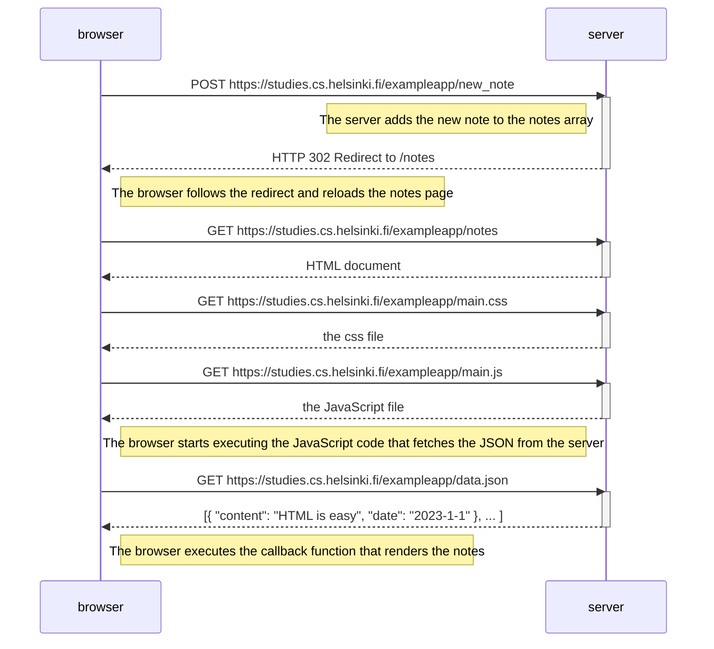
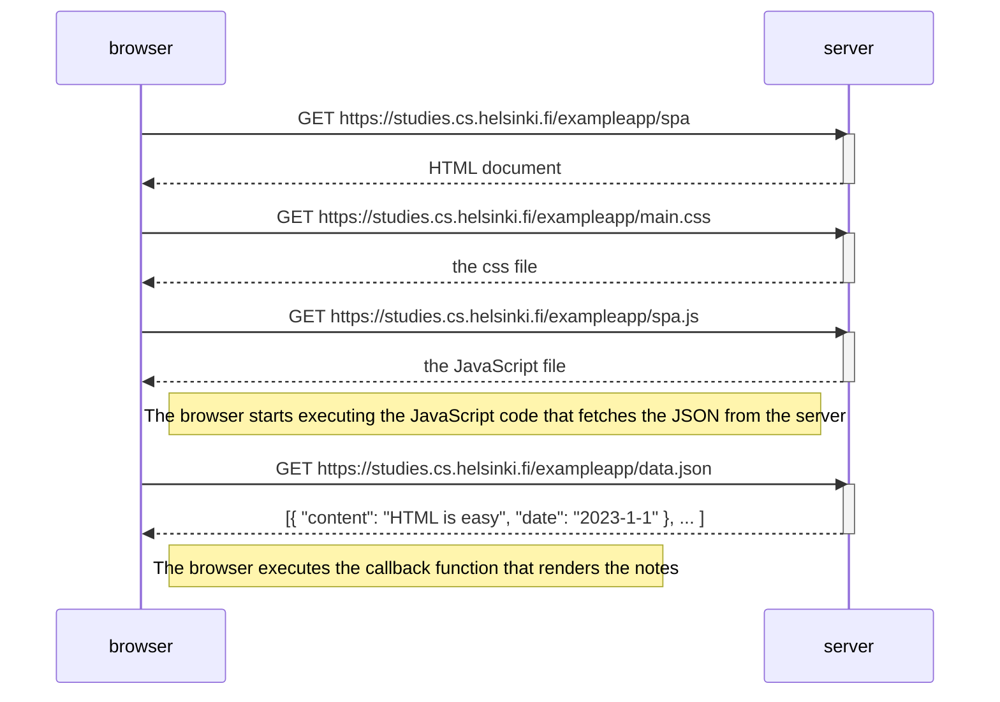
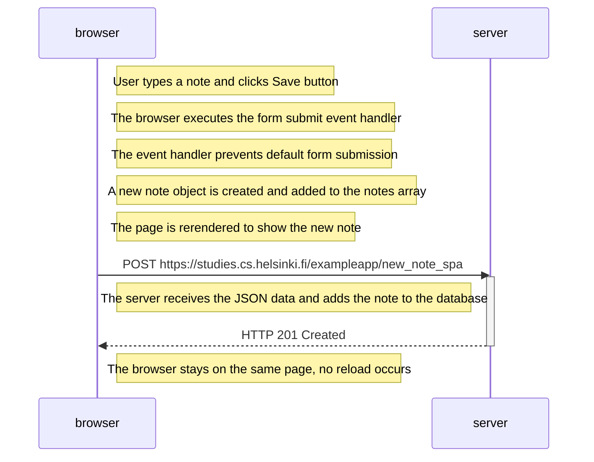

# Full Stack Course Part 0 - Exercise Solutions

## Exercise 0.4: New note diagram

This diagram shows what happens when a user creates a new note on the traditional notes page by filling in the form and clicking Save.

---

## Exercise 0.5: Single page app diagram

This diagram shows what happens when a user navigates to the single-page app version of the notes application.

---

## Exercise 0.6: New note in Single page app diagram

This diagram shows what happens when a user creates a new note in the single-page app version. Unlike the traditional version, the page does not reload.

---

## Key Differences Between Traditional and SPA Approaches

### Traditional Web App (Exercise 0.4):
- Form submission triggers a full page reload
- Server responds with HTTP 302 redirect
- Browser makes multiple new requests (HTML, CSS, JS, JSON)
- All resources are re-fetched from the server

### Single Page App (Exercise 0.6):
- Form submission is handled by JavaScript
- No page reload occurs
- Only one POST request is sent to the server
- The page is updated dynamically using the DOM-API
- Server responds with HTTP 201 (no redirect)
- Much more efficient and provides a smoother user experience

